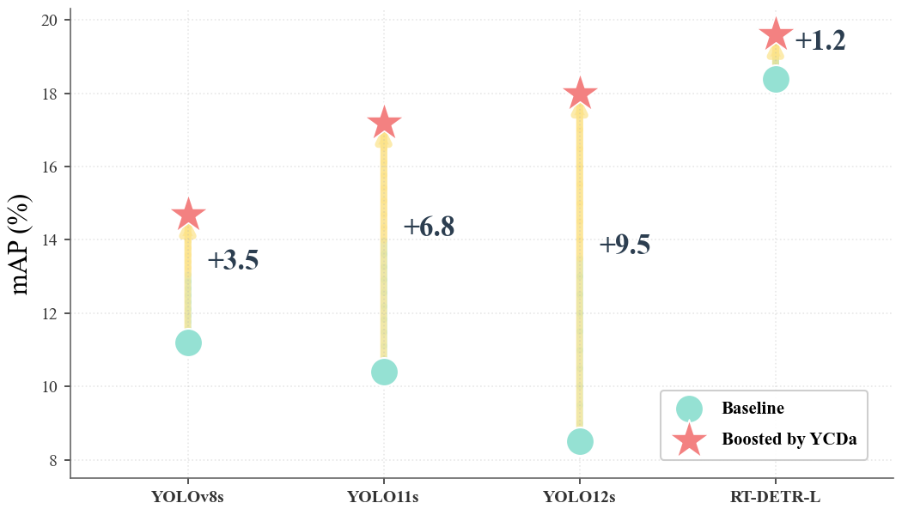
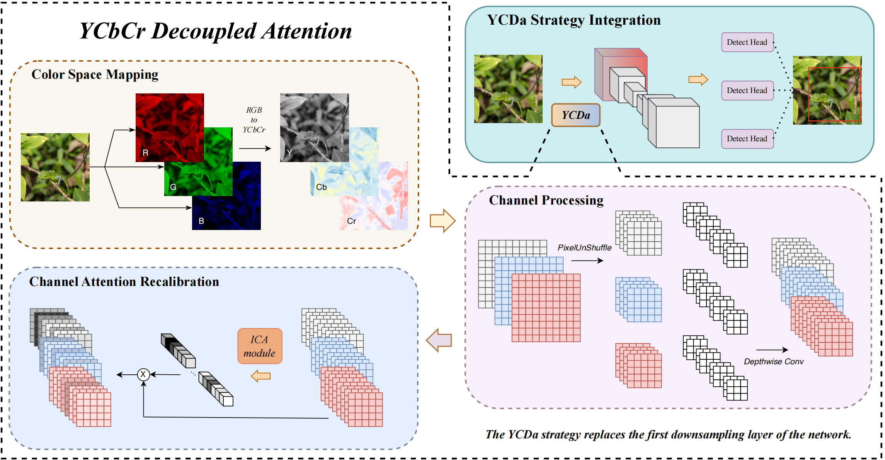
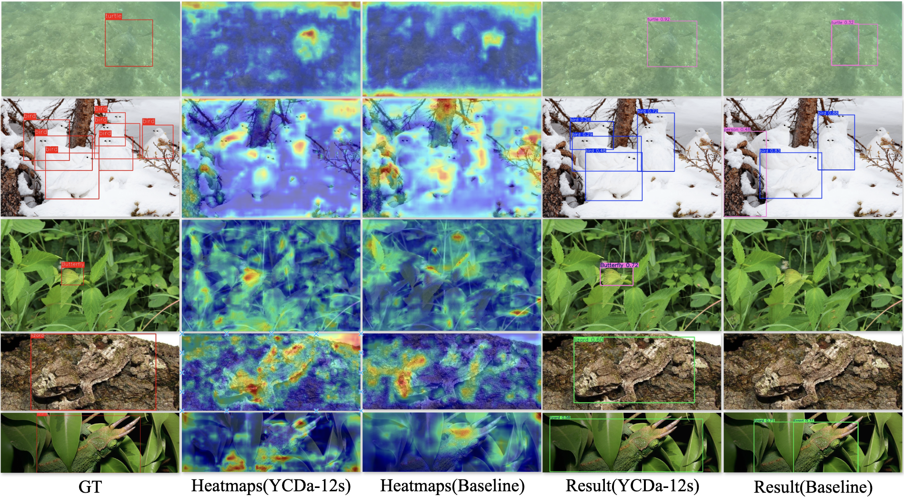

# YCDa: YCbCr Decoupled Attention for Real-time Realistic Camouflaged Object Detection



## Overview

Human vision exhibits remarkable adaptability in perceiving objects under camouflage. When color cues become unreliable, the visual system instinctively shifts its reliance from chrominance (color) to luminance (brightness and texture), enabling more robust perception in visually confusing environments. Drawing inspiration from this biological mechanism, we propose **YCDa**, an efficient early-stage feature processing strategy that embeds this “chrominance–luminance decoupling and dynamic attention” principle into modern real-time detectors. Specifically, YCDa separates color and luminance information in the input stage and dynamically allocates attention across channels to amplify discriminative cues while suppressing misleading color noise. The strategy is plug-and-play and can be integrated into existing detectors by simply replacing the first downsampling layer. Extensive experiments on multiple baselines demonstrate that YCDa consistently improves performance with negligible overhead as shown in the figure above. Notably, **YCDa-YOLO12s** achieves a **112% improvement in mAP** over the baseline on COD10K-D and sets new state-of-the-art results for real-time camouflaged object detection across COD-D datasets.




## Performance Comparison

**Table: Performance comparison between YCDa-enhanced models and baselines on COD10K-D, NC4K-D, and CAMO-D datasets.** Bold indicates the best-performing method within each baseline group.

| Methods | COD10K-D | | | NC4K-D | | | CAMO-D | | |
|---------|----------|-------|-------|--------|-------|-------|--------|-------|-------|
| | mAP | AP50 | AP75 | mAP | AP50 | AP75 | mAP | AP50 | AP75 |
| **RT-DETR-L** | 18.4 | 26.6 | 19.3 | **35.9** | **50.8** | **36.9** | **29.3** | **39.5** | **31.2** |
| **RT-DETR-L + YCDa** | **19.6** | **28.3** | **20.7** | 34.1 | 48.7 | 34.0 | 22.5 | 30.1 | 23.1 |
| | | | | | | | | | |
| **YOLOv8s** | 11.2 | 19.9 | 10.9 | 29.0 | 45.1 | 29.9 | 20.5 | 31.1 | 21.2 |
| **YOLOv8s + YCDa** | **14.7** | **24.4** | **15.1** | **32.0** | **48.6** | **32.8** | **21.6** | **31.7** | **21.5** |
| | | | | | | | | | |
| **YOLO11s** | 10.4 | 17.5 | 10.5 | 27.0 | 40.5 | 28.3 | 21.4 | 31.3 | 21.7 |
| **YOLO11s + YCDa** | **17.2** | **26.3** | **18.3** | **31.9** | **47.0** | **33.5** | **25.5** | **36.1** | **26.3** |
| | | | | | | | | | |
| **YOLO12s** | 8.5 | 14.9 | 7.9 | 26.0 | 38.7 | 27.6 | 20.4 | 30.8 | 19.1 |
| **YOLO12s + YCDa** | **18.0** | **28.7** | **18.2** | **33.7** | **48.6** | **36.6** | **26.0** | **35.3** | **27.7** |


## Quick Start

```bash
cd YCDa/
python -m venv YCDa
source YCDa/bin/activate
pip install -e .
```

## Training

### YCDa-12s Model Pretrain
```bash
yolo detect train model=yolo12s-YCDa.yaml data=coco.yaml epochs=60 batch=32  device=0
```

### Camouflage task
```bash
yolo detect train model= data=yolo12s-YCDa.yaml epochs=300 pretrained=YCDa-12s-cocoPretrain.pt batch=16 patience=50 device=0
```

## Validation

```bash
yolo detect val model=YCDa-12s-COD10K-D.pt data=COD10K-D.yaml device=0 split=test
```

## Checkpoints

🔗 **[Download YCDa-12s-COD10K-D Checkpoints]()**


## Citation

If you find YCDa useful in your research, please consider citing our work.
